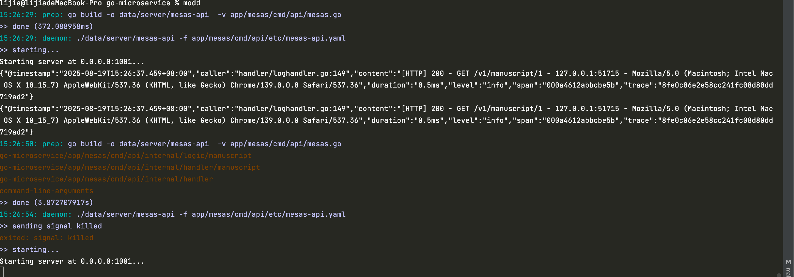
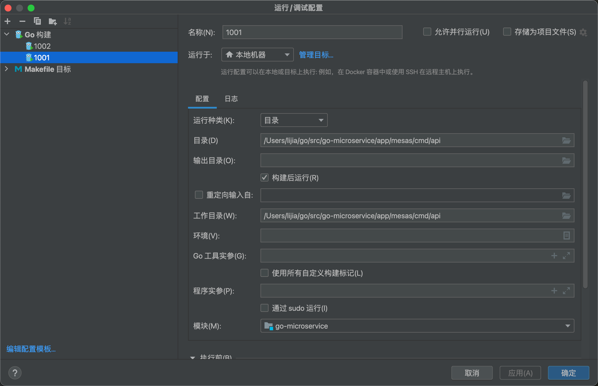
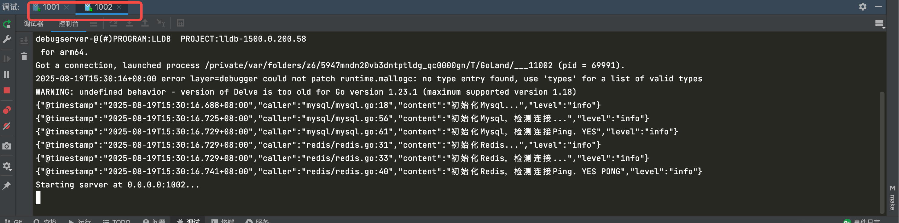
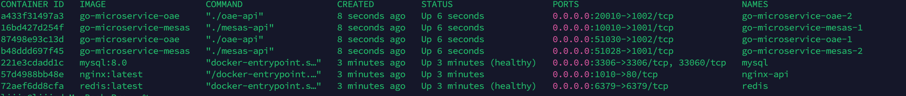
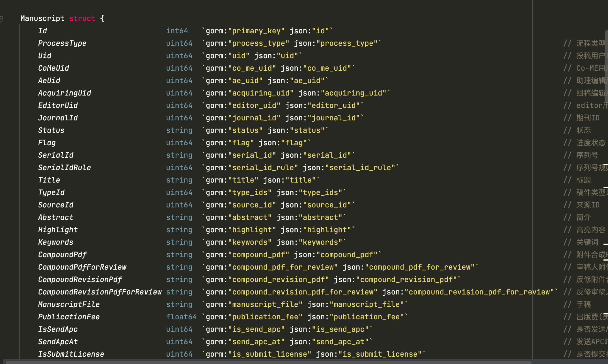

### go-microservice

- go-zero
- nginx网关
- elasticsearch
- docker
- docker-compose
- mysql
- redis
- gorm
- Xerr
- Basic

项目目录结构如下：

- app：所有业务代码包含api、rpc以及mq（消息队列、延迟队列、定时任务）
    - mesas：微服务
        - cmd：可执行层代码
            - api： HTTP服务
                - desc：api定义文件
                - etc：系统配置文件
                - internal：业务层代码
                    - config：配置中心
                    - handler：请求处理
                    - logic：逻辑层代码
                    - svc：上下文配置
                    - types：系统定义结构体
                - mesas.go：
                - Dockerfile：镜像构建脚本
        - model：模型层代码
    - oae
- common：
    - basic：系统初始化配置，可以自定义初始化不同微服务的链接池
        - mysql
        - redis
    - error：错误处理
    - middleware：中间件
    - result：自定义接口返回值结构信息
    - template：配置脚手架模板
    - translator：错误翻译
    - xerr：错误码及错误信息配置
- data：临时文件
- deploy：
    - nginx：网关配置
    - script：
        - mysql：生成model的sh工具
- docker-compose.yml：容器脚本
- go.mod：模块依赖
- go.sum：模块依赖
- Makefile：执行命令脚本
- README.md：描述

## 网关

nginx做对外网关

## 开发模式

本项目使用的是微服务开发，api （http） + rpc（grpc） ， api充当聚合服务，复杂、涉及到其他业务调用的统一写在rpc中，如果一些不会被其他服务依赖使用的简单业务，可以直接写在api的logic中

## 部署

本项目开发环境推荐docker-compose

### 项目环境搭建

#### 1、clone代码&更新依赖

```shell
$ git clone https://github.com/715-LJ/go-microservice.git
$ go mod tidy
```

#### 2、启动服务

##### 2.1 拉取运行环境镜像

因为本项目是用docker+热加载，即改即生效

前台app下所有api+rpc服务统一使用modd + golang

直接docker-compose去启动可以，但是考虑依赖可能会比较大会影响启动项目，有私有镜像仓库可以先把镜像拉取下来再去启动项目。

##### 2.2 启动项目(开发模式)

- 推荐modd热编译模式，实现热加载，开发过程不用每次都手动编译

```shell
go install github.com/cortesi/modd/cmd/modd@latest
modd.conf
app/mesas/cmd/api/**/*.go {
    prep: go build -o data/server/mesas-api  -v app/mesas/cmd/api/mesas.go
    daemon +sigkill: ./data/server/mesas-api -f app/mesas/cmd/api/etc/mesas-api.yaml
}
modd
```



- Golang 编辑器调试器，可以按照微服务模块设置不同的编译器，
    - 运行类型：目录
    - 运行路径/工作目录：/Users/lijia/go/src/go-microservice/app/mesas/cmd/api




```shell
API测试地址
http://127.0.0.1:1001/v1/manuscript/1
http://127.0.0.1:1002/v1/manuscript/1
```

##### 2.3 启动项目(线上模式)

Makefile 规则编译脚本

- make init：初始化服务模块及生成脚手架代码
- make up：启动服务
- make update：更新服务

```shell
$ make up
$ make update
```

【注】依赖的是项目根目录下的docker-compose.yml配置

```shell
API测试地址
http://127.0.0.1:1010/mesas/v1/manuscript/1
http://127.0.0.1:1010/oae/v1/manuscript/1
```

##### 2.3 项目部署

- docker-compose.yml
    - 采用分服务构建基础镜像，将基础镜像作为服务依赖，可以实现手动扩容，对内保留唯一不变端口，对外随机分配端口值，nginx做统一代理。
    - 
- docker-compose.override.yml
    - 扩展容器配置，配置或覆盖docker-compose.yml

#### 3、Gorm

GORM 的语法更符合 Go 的语言特点，不需要太多复杂的配置或方法调用。

- 结构体与数据库表的自动映射
  
- 支持多种数据库

```shell
func NewManuscriptModel() ManuscriptModel {
	return &defaultmanuscriptModel{
		conn: mysql.GetDB(),
	}
}
```

- 链式调用

```shell
manuscript := &Manuscript{}

if err := this.conn.Where(Manuscript{Id: manuscriptId}).First(&manuscript).Error; err != nil {
    return nil, err

}

return manuscript, nil
```

- Hooks 和回调机制

```shell
func (user *User) BeforeCreate(tx *gorm.DB) (err error) {
    // 在创建用户之前执行的逻辑
    return
}
```

- 事务支持

```shell
tx := db.Begin()
if err := tx.Create(&manuscript).Error; err != nil {
    tx.Rollback()
    return err
}
tx.Commit()
```

- 结构体与数据库表的自动映射

```shell
GORM 可以自动将 Go 结构体映射到数据库表，并且可以轻松处理表的关联关系（如一对一、一对多、多对多）。这使得开发者在编写模型时，不需要手动创建大量的 SQL 语句。
type User struct {
    gorm.Model
    Name string
    Orders []Order
}
```

- 预加载（Preloading）和关联查询

```shell
var users []User
db.Preload("Orders").Find(&users)

```

#### 4、Xerr

/common/xerr

```shell
if err != nil {
    return nil, xerr.NewErrCodeMsg(xerr.SERVER_COMMON_ERROR, xerr.MapErrMsg(xerr.SERVER_COMMON_ERROR))
}
```

定义错误码：/common/xerr/errCode.go

定义错信息：/common/xerr/errMsg.go
